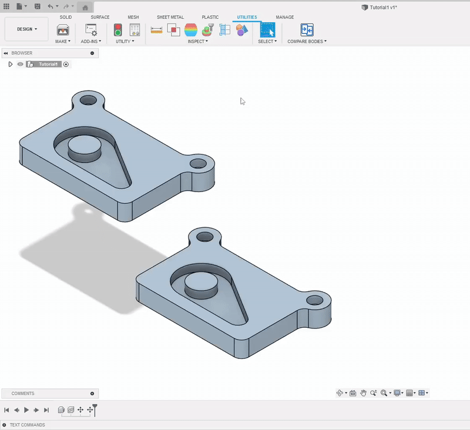

<h1 align="center">
  
  Compare Bodies for Fusion 360
</h1>

  <strong>Compare two selected bodies by volume and surface area</strong>

  

---

## Table of Contents
- [Overview](#overview)
- [Installation & Usage](#installation--usage)
- [License & Disclaimer](#license--disclaimer)
- [Contact](#contact)

---

## Overview

<h1 align="center">
  
</h1>

**Compare Bodies** is a Fusion 360 add-in that allows you to compare two selected bodies directly within the design environment.

After selecting two bodies, the tool calculates and compares:
- Volume
- Surface area
- Geometry similarity (based on face and edge counts)

This tool is ideal for validating duplicate geometry or tolerance-based differences.

---

## Installation & Usage

- ### Setup
1. Download latest `.zip` release.
2. Extract the archive.
3. Copy the add-on folder to the following directory:  
**`%appdata%\Autodesk\Autodesk Fusion 360\API\AddIns`**.
4. Open **Fusion 360**.
5. Press **`Shift + S`** or go to **Tools → Scripts and Add-Ins**.
6. In the upper part of the window, click on the **plus** (**`+`**).
7. In the Add-Ins dialog, choose `Link an App from Local` to load your add-on directly from a local folder. Navigate to the folder where your add-on is located and select it.
8. Select the add-on from the list and click **`Run`**.
9. To have the add-on run automatically at startup, check the **`Run on Startup`** box.

**⚠️ Important:**
- **Compare Bodies** works **only on Windows**.
- If the **AddIns** folder doesn't exist, create it manually.
- If the add-on doesn't run, try restarting Fusion 360.

### Usage

1. Open the **Solid** workspace in Fusion 360
2. Locate the **Utilities** tab
3. Click the **Compare Bodies** button
4. Select two bodies and set the comparison tolerance
5. Review the results in the message dialog

---

## License & Disclaimer

This project is licensed under the **MIT License** – see the [LICENSE.md](LICENSE.md) file for full details.

---

## Contact

**Questions or feedback? Get in touch!**

- **Email:** [maestrofusion360@gmail.com](mailto:maestrofusion360@gmail.com)  
- **Telegram:** [@MaestroFusion360](https://t.me/MaestroFusion360)

---

  

